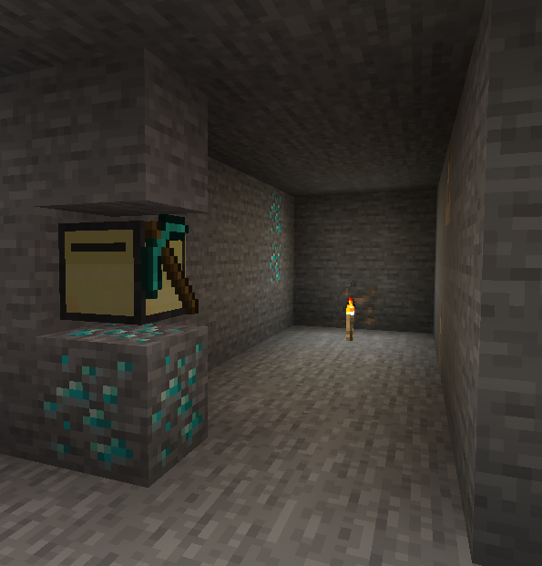

# 3x3 Stripmine

This program is designed to create a 3x3 stripmine in Minecraft using ComputerCraft. It includes features for recovery, inventory management, and customizable parameters.

This program was commissioned by UCG on [Fiverr](https://www.fiverr.com/fatboychummy).



## Features

- **3x3 Stripmine**: Automatically creates a 3x3 stripmine.
- **Recovery**: If the chunk the turtle is in is unloaded, it can recover and continue mining (in most cases).
- **Inventory Management**: Automatically dumps inventory into a chest when full.
- **Customizable Parameters**: Allows customization of tunnel length, branch length, and other parameters.
- **Torch Placement**: Automatically places torches to light up the mine (if enabled).

## Usage
- Place the turtle in the desired starting position. This position should be the middle-left of your desired stripmine, i.e:
```
OOO
#OO
OOO
# -> turtle
```
- Run the program with the desired parameters. For example:
```
stripmine.lua --length=64 --branchlength=16 -t
```
The turtle will now start mining in a 3x3 pattern, placing torches every 10 blocks.

### Command-Line Options
- `--length=<number>`: The length of the main tunnel to dig (default: 16).
- `--branchlength=<number>`: The length of the branches to dig (default: 8).
- `--branchdistance=<number>`: The distance between branches (default: 4).
- `--torchinterval=<number>`: The distance between torches placed in the tunnel (default: 10).
- `-r`, `--resume`: Resume a previously saved stripmine run. This is mainly used internally, but can be useful for manual recovery.
- `-t`, `--torches`: Place torches in the tunnel.
- `-h`, `--help`: Show the help message and exit.
- `-d`, `--debug`: Enable debug mode for additional logging.

Note that multiple options can be combined, i.e: `stripmine.lua -trd` would enable torches, resume a previous run, and enable debug mode.

## Requirements
- Turtle with a pickaxe.
- Dump chest behind the turtle's starting position
- (Optional) A chest above the turtle's starting position for fuel and torches.
  - The turtle will prefer to take items from this chest, but will also take items from the dump chest if there is no chest above the turtle's starting position (or it is empty).

## Installation

Run the following command in the shell:
```
wget run https://raw.githubusercontent.com/Fatboychummy-Fiverr/tx_ucg_wide_stripmine/refs/heads/main/installer.lua
```

Follow the prompts (press 'y') to install the program. The installer will download anything needed.